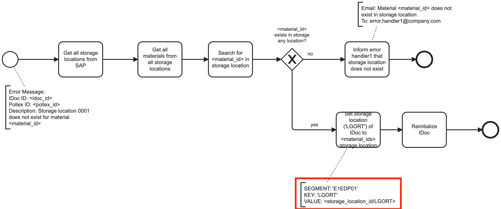
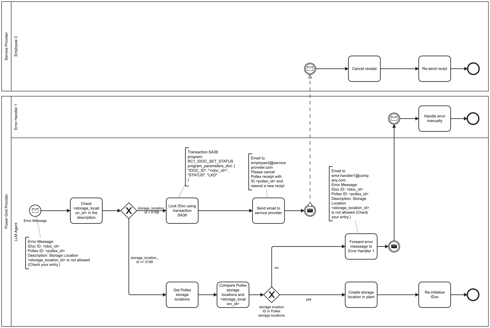

# Online Appendix: A Step Towards Cognitive Automation: Integrating LLM Agents with Process Rules

## Appendix A: Code
### 0. Installation
#### 0.1 Create conda environment
Execute:
```
conda env create -f agentic_bpa.yml
```

#### 0.2 Get and store an OpenAI API key
1. Create an OpenAI account and setup your billing.

2. Deposit $25 to the account.

3. Generate an API key [here](https://platform.openai.com/api-keys).

4. Setup the OpenAI API key as described [here](https://help.openai.com/en/articles/5112595-best-practices-for-api-key-safety).

### 1. Simulation of Error Handling and User Requests
Run the Jupyter notebooks in the following order:

1. _00_rule_generation.ipynb_
2. _01_description_generation.ipynb_
3. _02_vector_db_generation.ipynb_
4. _03_simulation_rules.ipynb_
5. _04_simulation_descriptions.ipynb_
6. _03_simulation_rules_user_requests.ipynb_
7. _04_simulation_descriptions_user_requests.ipynb_
8. _07_results.ipynb_

This will produce the results.

You can also just run _07_results.ipynb_ to gather the results only. 


### 2. Minimal Working Example
You can run _08_minimal_working_example.ipynb_ when you only want to try out a minimal example.

The minimal example will use the existing rules and descriptions and run only one process example for the error-handling simulation.

### 3. Prompt Engineering Examples
In the folder _prompt_engineering_examples_ some examples show how precise information is important for our approach.


## Appendix B: Files
### Prompt Engineering Examples
#### Error-Handling


The additional information in the red box was initially not included in the process diagram. This led the LLM agent to search the BELNR in "E1EDK02" instead of the "E1EDP01", which is not incorrect but without providing the correct segment the LLM agent could also hallucinate an incorrect segment, because there is no additional information given in the BPMN model leading to an incomplete rule.



We can see the same problem as in the previous example within the image above. In case of the image above the LLM agent chose the 'E1EDL24' segment instead of the intended but not explicitly modeled 'E1EDP01' because there is no additional information given in the BPMN model leading to an incomplete rule.

#### User Requests


When the above example is transformed in a user request to the LLM agent and the rpa_parameter 'ORDER_NUMBER' is not explicitly named, it falsely refers to 'order id'.


Similar to the example above, the LLM agent fails to set the right parameters when not explicitly named in the user request. 

### BPMN Models for the Processes in the Error Handling Simulation
Process 1


Process 2


Process 2


Process 3


Process 4


Process 5


Process 6


Process 7


### BPMN Models for the User Requests
Process: 0000


Process: 0001


Process: 0002


Process: 0003


Process: 0004


Process: 0005


Process: 0006


Process: 0007


Process: 0008


Process: 0009


Process: 0010


Process: 0011


Process: 0012


Process: 0013


Process: 0014


Process: 0015


Process: 0016


Process: 0017


Process: 0018


Process: 0019


Process: 0020


Process: 0021


Process: 0022


Process: 0023


### Other Files
1. Data for the error-handling simulation can be found under _error_cases_translated.csv_
2. Data for the user request simulation can be found under _user_requests.json_
3. The five different rules generated are stored in the folder _rules_.
4. The five different rules databases generated are stored in the folder _vector_db_.
5. The five different descriptions generated are stored in the folder _descriptions_
6. The five different descriptions generated are stored in the folder _vector_db_descriptions_


